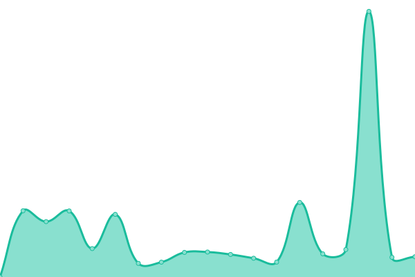
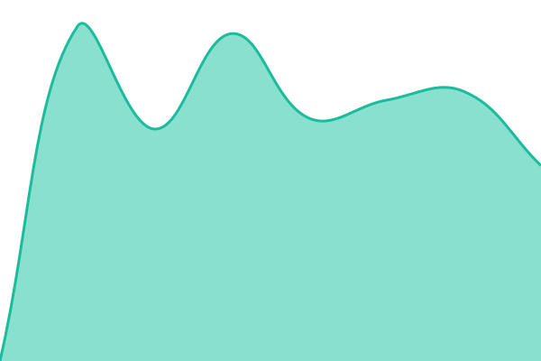
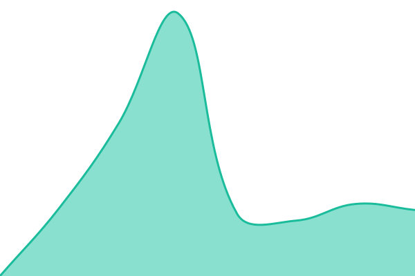
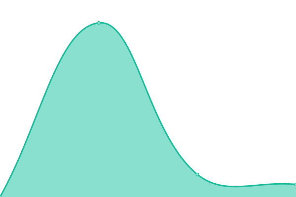
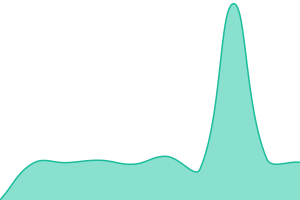
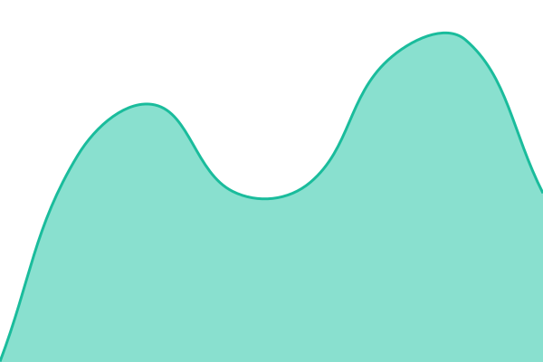
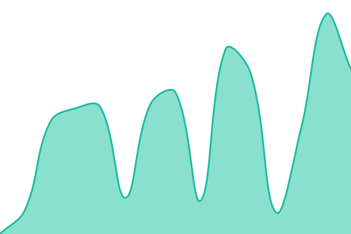
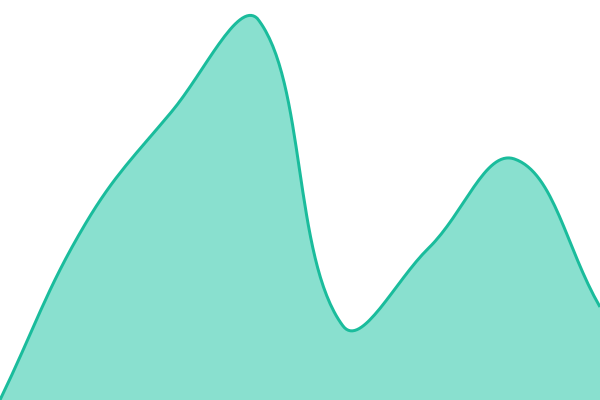
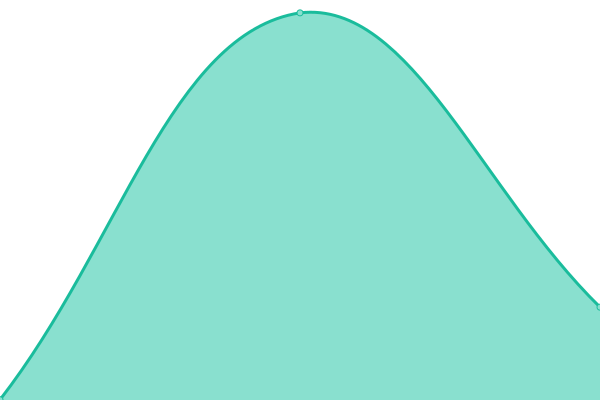

# [📈 Live Status](https://upmin-dev.github.io/UP-time): <!--live status--> **🟧 Partial outage**

This repository contains the open-source uptime monitor and status page for [UP Mindanao Developer](https://upmin-dev.github.io/UP-time), powered by [Upptime](https://github.com/upptime/upptime).

With [Upptime](https://upptime.js.org), you can get your own unlimited and free uptime monitor and status page, powered entirely by a GitHub repository. We use [Issues](https://github.com/upmin-dev/UP-time/issues) as incident reports, [Actions](https://github.com/upmin-dev/UP-time/actions) as uptime monitors, and [Pages](https://upmin-dev.github.io/UP-time) for the status page.

<!--start: status pages-->
<!-- This summary is generated by Upptime (https://github.com/upptime/upptime) -->
<!-- Do not edit this manually, your changes will be overwritten -->
<!-- prettier-ignore -->
| URL | Status | History | Response Time | Uptime |
| --- | ------ | ------- | ------------- | ------ |
|  [Main Website](https://www2.upmin.edu.ph) | 🟥 Down | [main-website.yml](https://github.com/upmin-dev/UP-time/commits/HEAD/history/main-website.yml) | 

 0ms
     
 | 

<a href="https://upmin-dev.github.io/UP-time/history/main-website">0.00%</a>
    

|  [Main Website (NEW)](https://prod.upmin.edu.ph) | 🟥 Down | [main-website-new.yml](https://github.com/upmin-dev/UP-time/commits/HEAD/history/main-website-new.yml) | 

 0ms
     
 | 

<a href="https://upmin-dev.github.io/UP-time/history/main-website-new">0.00%</a>
    

|  [ACAD Infomation Management System](https://acad.upmin.edu.ph) | 🟩 Up | [acad-infomation-management-system.yml](https://github.com/upmin-dev/UP-time/commits/HEAD/history/acad-infomation-management-system.yml) | 

 2118ms
     
 | 

<a href="https://upmin-dev.github.io/UP-time/history/acad-infomation-management-system">95.44%</a>
    

|  [Cashier Office IS](https://cashier.upmin.edu.ph) | 🟥 Down | [cashier-office-is.yml](https://github.com/upmin-dev/UP-time/commits/HEAD/history/cashier-office-is.yml) | 

 0ms
     
 | 

<a href="https://upmin-dev.github.io/UP-time/history/cashier-office-is">0.00%</a>
    

|  [CSRS Admin](https://csrsadmin.upmin.edu.ph) | 🟩 Up | [csrs-admin.yml](https://github.com/upmin-dev/UP-time/commits/HEAD/history/csrs-admin.yml) | 

 749ms
     
 | 

<a href="https://upmin-dev.github.io/UP-time/history/csrs-admin">100.00%</a>
    

|  [CSRS Adviser](https://adviser.upmin.edu.ph/index.php?go=login) | 🟩 Up | [csrs-adviser.yml](https://github.com/upmin-dev/UP-time/commits/HEAD/history/csrs-adviser.yml) | 

 897ms
     
 | 

<a href="https://upmin-dev.github.io/UP-time/history/csrs-adviser">95.44%</a>
    

|  [CSRS Cashier](https://cashier.upmin.edu.ph/index.php?go=login) | 🟥 Down | [csrs-cashier.yml](https://github.com/upmin-dev/UP-time/commits/HEAD/history/csrs-cashier.yml) | 

 0ms
     
 | 

<a href="https://upmin-dev.github.io/UP-time/history/csrs-cashier">0.00%</a>
    

|  [CSRS Clearance](https://clearance.upmin.edu.ph/index.php?go=login) | 🟩 Up | [csrs-clearance.yml](https://github.com/upmin-dev/UP-time/commits/HEAD/history/csrs-clearance.yml) | 

 1051ms
     
 | 

<a href="https://upmin-dev.github.io/UP-time/history/csrs-clearance">95.44%</a>
    

|  [CSRS Faculty](https://faculty.upmin.edu.ph/index.php?go=login) | 🟩 Up | [csrs-faculty.yml](https://github.com/upmin-dev/UP-time/commits/HEAD/history/csrs-faculty.yml) | 

 1117ms
     
 | 

<a href="https://upmin-dev.github.io/UP-time/history/csrs-faculty">95.44%</a>
    

|  [CSRS Scholarship](https://scholarship.upmin.edu.ph/index.php?go=login) | 🟩 Up | [csrs-scholarship.yml](https://github.com/upmin-dev/UP-time/commits/HEAD/history/csrs-scholarship.yml) | 

 1173ms
     
 | 

<a href="https://upmin-dev.github.io/UP-time/history/csrs-scholarship">95.45%</a>
    

|  [CSRS SET](https://csrsset.upmin.edu.ph/index.php?go=login) | 🟩 Up | [csrs-set.yml](https://github.com/upmin-dev/UP-time/commits/HEAD/history/csrs-set.yml) | 

 1031ms
     
 | 

<a href="https://upmin-dev.github.io/UP-time/history/csrs-set">95.45%</a>
    

|  [CSRS Student](https://student.upmin.edu.ph/index.php?go=login) | 🟩 Up | [csrs-student.yml](https://github.com/upmin-dev/UP-time/commits/HEAD/history/csrs-student.yml) | 

 1059ms
     
 | 

<a href="https://upmin-dev.github.io/UP-time/history/csrs-student">95.46%</a>
    

|  [BA English Creative Writing Website](https://baecw.upmin.edu.ph) | 🟥 Down | [ba-english-creative-writing-website.yml](https://github.com/upmin-dev/UP-time/commits/HEAD/history/ba-english-creative-writing-website.yml) | 

 0ms
     
 | 

<a href="https://upmin-dev.github.io/UP-time/history/ba-english-creative-writing-website">0.00%</a>
    

|  [Department of Food and Science Chemistry Website](https://dfsc.upmin.edu.ph) | 🟥 Down | [department-of-food-and-science-chemistry-website.yml](https://github.com/upmin-dev/UP-time/commits/HEAD/history/department-of-food-and-science-chemistry-website.yml) | 

 3308ms
     
 | 

<a href="https://upmin-dev.github.io/UP-time/history/department-of-food-and-science-chemistry-website">0.00%</a>
    

|  [Department of Mathematics, Physics and Computer Science Website](https://dmpcs.upmin.edu.ph) | 🟥 Down | [department-of-mathematics-physics-and-computer-science-website.yml](https://github.com/upmin-dev/UP-time/commits/HEAD/history/department-of-mathematics-physics-and-computer-science-website.yml) | 

 902ms
     
 | 

<a href="https://upmin-dev.github.io/UP-time/history/department-of-mathematics-physics-and-computer-science-website">100.00%</a>
    

|  [Mindanao Studies Center Website](https://msc.upmin.edu.ph) | 🟥 Down | [mindanao-studies-center-website.yml](https://github.com/upmin-dev/UP-time/commits/HEAD/history/mindanao-studies-center-website.yml) | 

 0ms
     
 | 

<a href="https://upmin-dev.github.io/UP-time/history/mindanao-studies-center-website">0.00%</a>
    

|  [Agri-Analytics Lab Website](https://upmin-agrianalyticslab.up.edu.ph) | 🟩 Up | [agri-analytics-lab-website.yml](https://github.com/upmin-dev/UP-time/commits/HEAD/history/agri-analytics-lab-website.yml) | 

 449ms
     
 | 

<a href="https://upmin-dev.github.io/UP-time/history/agri-analytics-lab-website">100.00%</a>
    

|  [AiDurian Project Website](https://aidurian.upmin.edu.ph) | 🟥 Down | [ai-durian-project-website.yml](https://github.com/upmin-dev/UP-time/commits/HEAD/history/ai-durian-project-website.yml) | 

 0ms
     
 | 

<a href="https://upmin-dev.github.io/UP-time/history/ai-durian-project-website">0.00%</a>
    

|  [COVID-19 Insights](https://upmindanao.shinyapps.io/covid19-insights-up-mindanao) | 🟩 Up | [covid-19-insights.yml](https://github.com/upmin-dev/UP-time/commits/HEAD/history/covid-19-insights.yml) | 

 1320ms
     
 | 

<a href="https://upmin-dev.github.io/UP-time/history/covid-19-insights">100.00%</a>
    

|  [Marine Biodiversity Database Project](https://mabida.upmin.edu.ph) | 🟩 Up | [marine-biodiversity-database-project.yml](https://github.com/upmin-dev/UP-time/commits/HEAD/history/marine-biodiversity-database-project.yml) | 

 2270ms
     
 | 

<a href="https://upmin-dev.github.io/UP-time/history/marine-biodiversity-database-project">0.00%</a>
    

|  [Philippine Genome Center Website](https://pgc.upmin.edu.ph) | 🟥 Down | [philippine-genome-center-website.yml](https://github.com/upmin-dev/UP-time/commits/HEAD/history/philippine-genome-center-website.yml) | 

 0ms
     
 | 

<a href="https://upmin-dev.github.io/UP-time/history/philippine-genome-center-website">0.00%</a>
    

|  [TTBDO](https://upmin-ttbdo.up.edu.ph) | 🟩 Up | [ttbdo.yml](https://github.com/upmin-dev/UP-time/commits/HEAD/history/ttbdo.yml) | 

 434ms
     
 | 

<a href="https://upmin-dev.github.io/UP-time/history/ttbdo">100.00%</a>
    

|  [ALARM Library Website](https://upalarm.upmin.edu.ph) | 🟩 Up | [alarm-library-website.yml](https://github.com/upmin-dev/UP-time/commits/HEAD/history/alarm-library-website.yml) | 

 3431ms
     
 | 

<a href="https://upmin-dev.github.io/UP-time/history/alarm-library-website">89.88%</a>
    

|  [ALARM Library Website Backup](https://alarm2.upmin.edu.ph) | 🟥 Down | [alarm-library-website-backup.yml](https://github.com/upmin-dev/UP-time/commits/HEAD/history/alarm-library-website-backup.yml) | 

 0ms
     
 | 

<a href="https://upmin-dev.github.io/UP-time/history/alarm-library-website-backup">0.00%</a>
    

|  [GIYA Website](https://upmin-ilc.up.edu.ph) | 🟩 Up | [giya-website.yml](https://github.com/upmin-dev/UP-time/commits/HEAD/history/giya-website.yml) | 

 414ms
     
 | 

<a href="https://upmin-dev.github.io/UP-time/history/giya-website">100.00%</a>
    

|  [iLib](http://ilib.upmin.edu.ph) | 🟥 Down | [i-lib.yml](https://github.com/upmin-dev/UP-time/commits/HEAD/history/i-lib.yml) | 

 16980ms
     
 | 

<a href="https://upmin-dev.github.io/UP-time/history/i-lib">34.40%</a>
    

|  [Information Technology Office Website](https://ito.upmin.edu.ph) | 🟥 Down | [information-technology-office-website.yml](https://github.com/upmin-dev/UP-time/commits/HEAD/history/information-technology-office-website.yml) | 

 805ms
     
 | 

<a href="https://upmin-dev.github.io/UP-time/history/information-technology-office-website">0.00%</a>
    

|  [Integrated System for Internal Processes](https://isip.upmin.edu.ph) | 🟩 Up | [integrated-system-for-internal-processes.yml](https://github.com/upmin-dev/UP-time/commits/HEAD/history/integrated-system-for-internal-processes.yml) | 

 1926ms
     
 | 

<a href="https://upmin-dev.github.io/UP-time/history/integrated-system-for-internal-processes">90.31%</a>
    

|  [Integrated System for Internal Processes (Dev)](https://isip-dev.upmin.edu.ph) | 🟩 Up | [integrated-system-for-internal-processes-dev.yml](https://github.com/upmin-dev/UP-time/commits/HEAD/history/integrated-system-for-internal-processes-dev.yml) | 

 613ms
     
 | 

<a href="https://upmin-dev.github.io/UP-time/history/integrated-system-for-internal-processes-dev">100.00%</a>
    

|  [KASSI Chat Bot](https://csmchatbot-testbeta.vercel.app) | 🟩 Up | [kassi-chat-bot.yml](https://github.com/upmin-dev/UP-time/commits/HEAD/history/kassi-chat-bot.yml) | 

 98ms
     
 | 

<a href="https://upmin-dev.github.io/UP-time/history/kassi-chat-bot">100.00%</a>
    

|  [KOHA Library System / Catalog](https://koha.upmin.edu.ph) | 🟩 Up | [koha-library-system-catalog.yml](https://github.com/upmin-dev/UP-time/commits/HEAD/history/koha-library-system-catalog.yml) | 

 3175ms
     
 | 

<a href="https://upmin-dev.github.io/UP-time/history/koha-library-system-catalog">89.87%</a>
    

|  [KOHA Library System Staff](http://staffkoha.upmin.edu.ph) | 🟩 Up | [koha-library-system-staff.yml](https://github.com/upmin-dev/UP-time/commits/HEAD/history/koha-library-system-staff.yml) | 

 2264ms
     
 | 

<a href="https://upmin-dev.github.io/UP-time/history/koha-library-system-staff">89.87%</a>
    

|  [KOHA Library System / Catalog Backup](http://koha2.upmin.edu.ph) | 🟥 Down | [koha-library-system-catalog-backup.yml](https://github.com/upmin-dev/UP-time/commits/HEAD/history/koha-library-system-catalog-backup.yml) | 

 0ms
     
 | 

<a href="https://upmin-dev.github.io/UP-time/history/koha-library-system-catalog-backup">0.00%</a>
    

|  [UPMIN Online Manuscript Manager](https://omm.upmin.edu.ph) | 🟥 Down | [upmin-online-manuscript-manager.yml](https://github.com/upmin-dev/UP-time/commits/HEAD/history/upmin-online-manuscript-manager.yml) | 

 1067ms
     
 | 

<a href="https://upmin-dev.github.io/UP-time/history/upmin-online-manuscript-manager">0.00%</a>
    

|  [Online Accomplishment Management System](http://oams.upmin.edu.ph) | 🟥 Down | [online-accomplishment-management-system.yml](https://github.com/upmin-dev/UP-time/commits/HEAD/history/online-accomplishment-management-system.yml) | 

 0ms
     
 | 

<a href="https://upmin-dev.github.io/UP-time/history/online-accomplishment-management-system">0.00%</a>
    

|  [OS Ticket](https://support.upmin.edu.ph) | 🟩 Up | [os-ticket.yml](https://github.com/upmin-dev/UP-time/commits/HEAD/history/os-ticket.yml) | 

 1340ms
     
 | 

<a href="https://upmin-dev.github.io/UP-time/history/os-ticket">0.00%</a>
    

|  [UPMin Online Journal System (NEW)](https://upminojs.poolreno.com) | 🟥 Down | [up-min-online-journal-system-new.yml](https://github.com/upmin-dev/UP-time/commits/HEAD/history/up-min-online-journal-system-new.yml) | 

 0ms
     
 | 

<a href="https://upmin-dev.github.io/UP-time/history/up-min-online-journal-system-new">0.00%</a>
    

|  [UPMin Online Journal System (OLD)](http://ojs.upmin.edu.ph) | 🟩 Up | [up-min-online-journal-system-old.yml](https://github.com/upmin-dev/UP-time/commits/HEAD/history/up-min-online-journal-system-old.yml) | 

 1792ms
     
 | 

<a href="https://upmin-dev.github.io/UP-time/history/up-min-online-journal-system-old">100.00%</a>
    

|  [SnipeIT Asset Management](https://ito-inventory.upmin.edu.ph) | 🟥 Down | [snipe-it-asset-management.yml](https://github.com/upmin-dev/UP-time/commits/HEAD/history/snipe-it-asset-management.yml) | 

 0ms
     
 | 

<a href="https://upmin-dev.github.io/UP-time/history/snipe-it-asset-management">0.00%</a>
    

|  [Vaultwarden Password Manager](https://ito-vault.upmin.edu.ph) | 🟥 Down | [vaultwarden-password-manager.yml](https://github.com/upmin-dev/UP-time/commits/HEAD/history/vaultwarden-password-manager.yml) | 

 3334ms
     
 | 

<a href="https://upmin-dev.github.io/UP-time/history/vaultwarden-password-manager">0.00%</a>
    

<!--end: status pages-->

[**Visit our status website →**](https://upmin-dev.github.io/UP-time)

## 📄 License

- Powered by: [Upptime](https://github.com/upptime/upptime)
- Code: [MIT](./LICENSE) © [Anand Chowdhary](https://anandchowdhary.com), supported by [Pabio](https://pabio.com)
- Data in the `./history` directory: [Open Database License](https://opendatacommons.org/licenses/odbl/1-0/)
