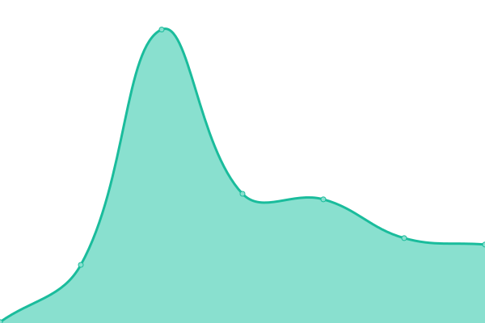
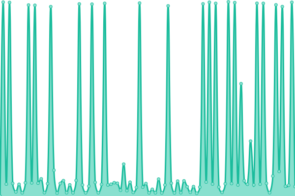
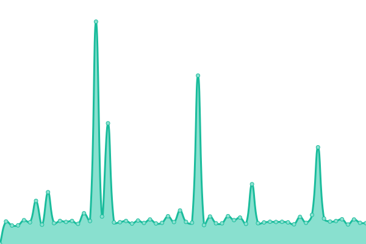

# [📈 Live Status](https://upmin-dev.github.io/UP-time): <!--live status--> **🟧 Partial outage**

This repository contains the open-source uptime monitor and status page for [UP Mindanao Developer](https://upmin-dev.github.io/UP-time), powered by [Upptime](https://github.com/upptime/upptime).

With [Upptime](https://upptime.js.org), you can get your own unlimited and free uptime monitor and status page, powered entirely by a GitHub repository. We use [Issues](https://github.com/upmin-dev/UP-time/issues) as incident reports, [Actions](https://github.com/upmin-dev/UP-time/actions) as uptime monitors, and [Pages](https://upmin-dev.github.io/UP-time) for the status page.

<!--start: status pages-->
<!-- This summary is generated by Upptime (https://github.com/upptime/upptime) -->
<!-- Do not edit this manually, your changes will be overwritten -->
<!-- prettier-ignore -->
| URL | Status | History | Response Time | Uptime |
| --- | ------ | ------- | ------------- | ------ |
|  [Main Website](https://www2.upmin.edu.ph) | 🟩 Up | [main-website.yml](https://github.com/upmin-dev/UP-time/commits/HEAD/history/main-website.yml) | 

 3741ms
     
 | 

<a href="https://upmin-dev.github.io/UP-time/history/main-website">95.53%</a>
    

|  [Main Website (NEW)](https://prod.upmin.edu.ph) | 🟩 Up | [main-website-new.yml](https://github.com/upmin-dev/UP-time/commits/HEAD/history/main-website-new.yml) | 

 2918ms
     
 | 

<a href="https://upmin-dev.github.io/UP-time/history/main-website-new">77.38%</a>
    

|  [ACAD Infomation Management System](https://acad.upmin.edu.ph) | 🟩 Up | [acad-infomation-management-system.yml](https://github.com/upmin-dev/UP-time/commits/HEAD/history/acad-infomation-management-system.yml) | 

 1364ms
     
 | 

<a href="https://upmin-dev.github.io/UP-time/history/acad-infomation-management-system">84.32%</a>
    

|  [Cashier Office IS](https://cashier.upmin.edu.ph) | 🟩 Up | [cashier-office-is.yml](https://github.com/upmin-dev/UP-time/commits/HEAD/history/cashier-office-is.yml) | 

 3291ms
     
 | 

<a href="https://upmin-dev.github.io/UP-time/history/cashier-office-is">99.59%</a>
    

|  [CSRS Admin](https://csrsadmin.upmin.edu.ph) | 🟩 Up | [csrs-admin.yml](https://github.com/upmin-dev/UP-time/commits/HEAD/history/csrs-admin.yml) | 

 3742ms
     
 | 

<a href="https://upmin-dev.github.io/UP-time/history/csrs-admin">98.91%</a>
    

|  [CSRS Adviser](https://adviser.upmin.edu.ph/index.php?go=login) | 🟩 Up | [csrs-adviser.yml](https://github.com/upmin-dev/UP-time/commits/HEAD/history/csrs-adviser.yml) | 

 2576ms
     
 | 

<a href="https://upmin-dev.github.io/UP-time/history/csrs-adviser">99.70%</a>
    

|  [CSRS Cashier](https://cashier.upmin.edu.ph/index.php?go=login) | 🟩 Up | [csrs-cashier.yml](https://github.com/upmin-dev/UP-time/commits/HEAD/history/csrs-cashier.yml) | 

 635ms
     
 | 

<a href="https://upmin-dev.github.io/UP-time/history/csrs-cashier">99.82%</a>
    

|  [CSRS Clearance](https://clearance.upmin.edu.ph/index.php?go=login) | 🟩 Up | [csrs-clearance.yml](https://github.com/upmin-dev/UP-time/commits/HEAD/history/csrs-clearance.yml) | 

 1491ms
     
 | 

<a href="https://upmin-dev.github.io/UP-time/history/csrs-clearance">99.30%</a>
    

|  [CSRS Faculty](https://faculty.upmin.edu.ph/index.php?go=login) | 🟩 Up | [csrs-faculty.yml](https://github.com/upmin-dev/UP-time/commits/HEAD/history/csrs-faculty.yml) | 

 3706ms
     
 | 

<a href="https://upmin-dev.github.io/UP-time/history/csrs-faculty">99.17%</a>
    

|  [CSRS Scholarship](https://scholarship.upmin.edu.ph/index.php?go=login) | 🟩 Up | [csrs-scholarship.yml](https://github.com/upmin-dev/UP-time/commits/HEAD/history/csrs-scholarship.yml) | 

 2571ms
     
 | 

<a href="https://upmin-dev.github.io/UP-time/history/csrs-scholarship">99.33%</a>
    

|  [CSRS SET](https://csrsset.upmin.edu.ph/index.php?go=login) | 🟩 Up | [csrs-set.yml](https://github.com/upmin-dev/UP-time/commits/HEAD/history/csrs-set.yml) | 

 1598ms
     
 | 

<a href="https://upmin-dev.github.io/UP-time/history/csrs-set">99.53%</a>
    

|  [CSRS Student](https://student.upmin.edu.ph/index.php?go=login) | 🟩 Up | [csrs-student.yml](https://github.com/upmin-dev/UP-time/commits/HEAD/history/csrs-student.yml) | 

 3391ms
     
 | 

<a href="https://upmin-dev.github.io/UP-time/history/csrs-student">99.34%</a>
    

|  [BA English Creative Writing Website](https://baecw.upmin.edu.ph) | 🟩 Up | [ba-english-creative-writing-website.yml](https://github.com/upmin-dev/UP-time/commits/HEAD/history/ba-english-creative-writing-website.yml) | 

 2513ms
     
 | 

<a href="https://upmin-dev.github.io/UP-time/history/ba-english-creative-writing-website">99.42%</a>
    

|  [Department of Food and Science Chemistry Website](https://dfsc.upmin.edu.ph) | 🟥 Down | [department-of-food-and-science-chemistry-website.yml](https://github.com/upmin-dev/UP-time/commits/HEAD/history/department-of-food-and-science-chemistry-website.yml) | 

 0ms
     
 | 

<a href="https://upmin-dev.github.io/UP-time/history/department-of-food-and-science-chemistry-website">0.00%</a>
    

|  [Department of Mathematics, Physics and Computer Science Website](https://dmpcs.upmin.edu.ph) | 🟩 Up | [department-of-mathematics-physics-and-computer-science-website.yml](https://github.com/upmin-dev/UP-time/commits/HEAD/history/department-of-mathematics-physics-and-computer-science-website.yml) | 

 1792ms
     
 | 

<a href="https://upmin-dev.github.io/UP-time/history/department-of-mathematics-physics-and-computer-science-website">100.00%</a>
    

|  [Mindanao Studies Center Website](https://msc.upmin.edu.ph) | 🟥 Down | [mindanao-studies-center-website.yml](https://github.com/upmin-dev/UP-time/commits/HEAD/history/mindanao-studies-center-website.yml) | 

 0ms
     
 | 

<a href="https://upmin-dev.github.io/UP-time/history/mindanao-studies-center-website">0.00%</a>
    

|  [Agri-Analytics Lab Website](https://upmin-agrianalyticslab.up.edu.ph) | 🟩 Up | [agri-analytics-lab-website.yml](https://github.com/upmin-dev/UP-time/commits/HEAD/history/agri-analytics-lab-website.yml) | 

 440ms
     
 | 

<a href="https://upmin-dev.github.io/UP-time/history/agri-analytics-lab-website">99.78%</a>
    

|  [AiDurian Project Website](https://aidurian.upmin.edu.ph) | 🟥 Down | [ai-durian-project-website.yml](https://github.com/upmin-dev/UP-time/commits/HEAD/history/ai-durian-project-website.yml) | 

 1717ms
     
 | 

<a href="https://upmin-dev.github.io/UP-time/history/ai-durian-project-website">0.00%</a>
    

|  [COVID-19 Insights](https://upmindanao.shinyapps.io/covid19-insights-up-mindanao) | 🟩 Up | [covid-19-insights.yml](https://github.com/upmin-dev/UP-time/commits/HEAD/history/covid-19-insights.yml) | 

 1316ms
     
 | 

<a href="https://upmin-dev.github.io/UP-time/history/covid-19-insights">100.00%</a>
    

|  [Marine Biodiversity Database Project](https://mabida.upmin.edu.ph) | 🟩 Up | [marine-biodiversity-database-project.yml](https://github.com/upmin-dev/UP-time/commits/HEAD/history/marine-biodiversity-database-project.yml) | 

 5321ms
     
 | 

<a href="https://upmin-dev.github.io/UP-time/history/marine-biodiversity-database-project">99.42%</a>
    

|  [Philippine Genome Center Website](https://pgc.upmin.edu.ph) | 🟩 Up | [philippine-genome-center-website.yml](https://github.com/upmin-dev/UP-time/commits/HEAD/history/philippine-genome-center-website.yml) | 

 1217ms
     
 | 

<a href="https://upmin-dev.github.io/UP-time/history/philippine-genome-center-website">94.46%</a>
    

|  [TTBDO](https://upmin-ttbdo.up.edu.ph) | 🟩 Up | [ttbdo.yml](https://github.com/upmin-dev/UP-time/commits/HEAD/history/ttbdo.yml) | 

 285ms
     
 | 

<a href="https://upmin-dev.github.io/UP-time/history/ttbdo">99.78%</a>
    

|  [ALARM Library Website](https://upalarm.upmin.edu.ph) | 🟩 Up | [alarm-library-website.yml](https://github.com/upmin-dev/UP-time/commits/HEAD/history/alarm-library-website.yml) | 

 1212ms
     
 | 

<a href="https://upmin-dev.github.io/UP-time/history/alarm-library-website">65.04%</a>
    

|  [ALARM Library Website Backup](https://alarm2.upmin.edu.ph) | 🟥 Down | [alarm-library-website-backup.yml](https://github.com/upmin-dev/UP-time/commits/HEAD/history/alarm-library-website-backup.yml) | 

 0ms
     
 | 

<a href="https://upmin-dev.github.io/UP-time/history/alarm-library-website-backup">0.00%</a>
    

|  [GIYA Website](https://upmin-ilc.up.edu.ph) | 🟩 Up | [giya-website.yml](https://github.com/upmin-dev/UP-time/commits/HEAD/history/giya-website.yml) | 

 320ms
     
 | 

<a href="https://upmin-dev.github.io/UP-time/history/giya-website">100.00%</a>
    

|  [iLib](http://ilib.upmin.edu.ph) | 🟩 Up | [i-lib.yml](https://github.com/upmin-dev/UP-time/commits/HEAD/history/i-lib.yml) | 

 1501ms
     
 | 

<a href="https://upmin-dev.github.io/UP-time/history/i-lib">98.40%</a>
    

|  [Information Technology Office Website](https://ito.upmin.edu.ph) | 🟥 Down | [information-technology-office-website.yml](https://github.com/upmin-dev/UP-time/commits/HEAD/history/information-technology-office-website.yml) | 

 0ms
     
 | 

<a href="https://upmin-dev.github.io/UP-time/history/information-technology-office-website">0.00%</a>
    

|  [Integrated System for Internal Processes](https://isip.upmin.edu.ph) | 🟩 Up | [integrated-system-for-internal-processes.yml](https://github.com/upmin-dev/UP-time/commits/HEAD/history/integrated-system-for-internal-processes.yml) | 

 2177ms
     
 | 

<a href="https://upmin-dev.github.io/UP-time/history/integrated-system-for-internal-processes">99.84%</a>
    

|  [Integrated System for Internal Processes (Dev)](https://isip-dev.upmin.edu.ph) | 🟩 Up | [integrated-system-for-internal-processes-dev.yml](https://github.com/upmin-dev/UP-time/commits/HEAD/history/integrated-system-for-internal-processes-dev.yml) | 

 1340ms
     
 | 

<a href="https://upmin-dev.github.io/UP-time/history/integrated-system-for-internal-processes-dev">85.14%</a>
    

|  [KASSI Chat Bot](https://csmchatbot-testbeta.vercel.app) | 🟩 Up | [kassi-chat-bot.yml](https://github.com/upmin-dev/UP-time/commits/HEAD/history/kassi-chat-bot.yml) | 

 101ms
     
 | 

<a href="https://upmin-dev.github.io/UP-time/history/kassi-chat-bot">100.00%</a>
    

|  [KOHA Library System / Catalog](https://koha.upmin.edu.ph) | 🟩 Up | [koha-library-system-catalog.yml](https://github.com/upmin-dev/UP-time/commits/HEAD/history/koha-library-system-catalog.yml) | 

 4621ms
     
 | 

<a href="https://upmin-dev.github.io/UP-time/history/koha-library-system-catalog">78.06%</a>
    

|  [KOHA Library System Staff](http://staffkoha.upmin.edu.ph) | 🟩 Up | [koha-library-system-staff.yml](https://github.com/upmin-dev/UP-time/commits/HEAD/history/koha-library-system-staff.yml) | 

 2794ms
     
 | 

<a href="https://upmin-dev.github.io/UP-time/history/koha-library-system-staff">62.90%</a>
    

|  [KOHA Library System / Catalog Backup](http://koha2.upmin.edu.ph) | 🟥 Down | [koha-library-system-catalog-backup.yml](https://github.com/upmin-dev/UP-time/commits/HEAD/history/koha-library-system-catalog-backup.yml) | 

 0ms
     
 | 

<a href="https://upmin-dev.github.io/UP-time/history/koha-library-system-catalog-backup">0.00%</a>
    

|  [UPMIN Online Manuscript Manager](https://omm.upmin.edu.ph) | 🟥 Down | [upmin-online-manuscript-manager.yml](https://github.com/upmin-dev/UP-time/commits/HEAD/history/upmin-online-manuscript-manager.yml) | 

 0ms
     
 | 

<a href="https://upmin-dev.github.io/UP-time/history/upmin-online-manuscript-manager">0.00%</a>
    

|  [Online Accomplishment Management System](http://oams.upmin.edu.ph) | 🟩 Up | [online-accomplishment-management-system.yml](https://github.com/upmin-dev/UP-time/commits/HEAD/history/online-accomplishment-management-system.yml) | 

 1113ms
     
 | 

<a href="https://upmin-dev.github.io/UP-time/history/online-accomplishment-management-system">99.81%</a>
    

|  [OS Ticket](https://support.upmin.edu.ph) | 🟩 Up | [os-ticket.yml](https://github.com/upmin-dev/UP-time/commits/HEAD/history/os-ticket.yml) | 

 2764ms
     
 | 

<a href="https://upmin-dev.github.io/UP-time/history/os-ticket">92.08%</a>
    

|  [UPMin Online Journal System (NEW)](https://upminojs.poolreno.com) | 🟩 Up | [up-min-online-journal-system-new.yml](https://github.com/upmin-dev/UP-time/commits/HEAD/history/up-min-online-journal-system-new.yml) | 

 1007ms
     
 | 

<a href="https://upmin-dev.github.io/UP-time/history/up-min-online-journal-system-new">100.00%</a>
    

|  [UPMin Online Journal System (OLD)](http://ojs.upmin.edu.ph) | 🟩 Up | [up-min-online-journal-system-old.yml](https://github.com/upmin-dev/UP-time/commits/HEAD/history/up-min-online-journal-system-old.yml) | 

 3152ms
     
 | 

<a href="https://upmin-dev.github.io/UP-time/history/up-min-online-journal-system-old">99.84%</a>
    

|  [SnipeIT Asset Management](https://ito-inventory.upmin.edu.ph) | 🟥 Down | [snipe-it-asset-management.yml](https://github.com/upmin-dev/UP-time/commits/HEAD/history/snipe-it-asset-management.yml) | 

 1192ms
     
 | 

<a href="https://upmin-dev.github.io/UP-time/history/snipe-it-asset-management">0.00%</a>
    

|  [Vaultwarden Password Manager](https://ito-vault.upmin.edu.ph) | 🟩 Up | [vaultwarden-password-manager.yml](https://github.com/upmin-dev/UP-time/commits/HEAD/history/vaultwarden-password-manager.yml) | 

 1128ms
     
 | 

<a href="https://upmin-dev.github.io/UP-time/history/vaultwarden-password-manager">84.70%</a>
    

<!--end: status pages-->

[**Visit our status website →**](https://upmin-dev.github.io/UP-time)

## 📄 License

- Powered by: [Upptime](https://github.com/upptime/upptime)
- Code: [MIT](./LICENSE) © [Anand Chowdhary](https://anandchowdhary.com), supported by [Pabio](https://pabio.com)
- Data in the `./history` directory: [Open Database License](https://opendatacommons.org/licenses/odbl/1-0/)
